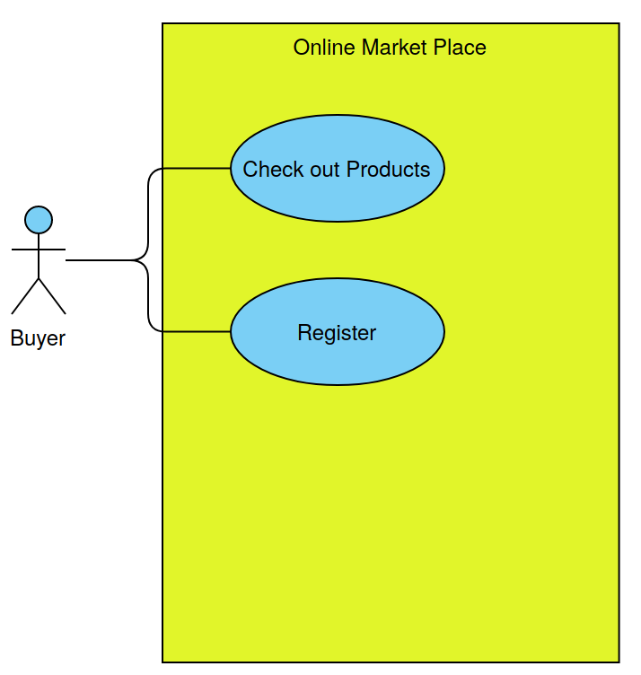
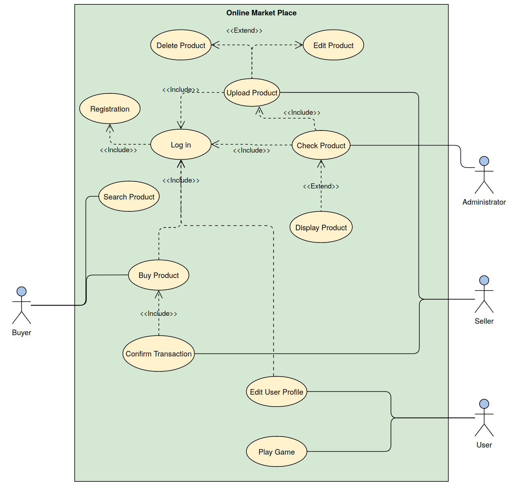
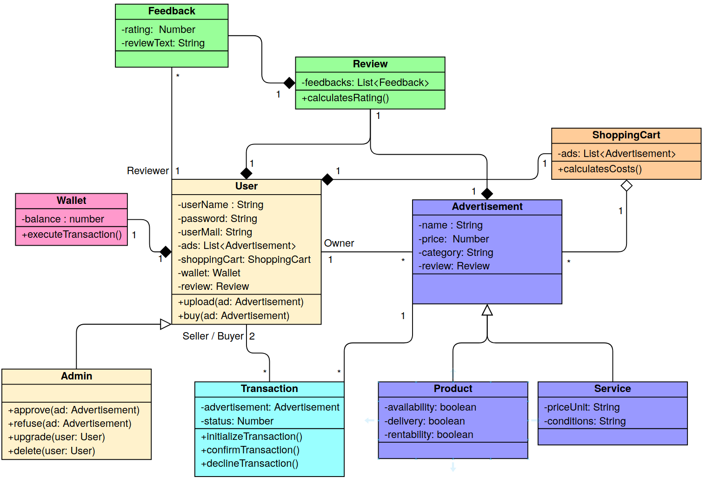

  

# STOR

STOR is an online market place specialised for vintage electronics, that allows users to sell and buy products and services online but extends the classic functionalities of web-based markets with a ground-breaking new features.
 

## Introduction

This document provides an overview of the project scope, objectives, use cases, functional and non-functional requirements, use case diagrams and reveals (in a later version) the seminal invention.

  

## Project Scope

The scope of this project is a web-based marketplace that allows users to sell, buy, lend and rent products and services online. After registering and setting up an account, users can upload products and services they want to sell on the website. Once an administrator has checked the product and given permission to sell it, it will be displayed on the website and other users will be able to buy it. To buy products a registration is required, but all visitors may check out the available products.

  

## Functional Requirements

*Milestone 2*

* *Registration:* Users need to be able to register, with their registration data being stored persistently.
* *Login:* After prior registration, users need to be able to login with their username and password.
* *Viewing Products:* Users need to be able to access the list of products up for sale. To examine the products, no login is required.
* *Uploading Products:* Registered Users must have the possibility to add products / services for sale / rent on the website.
* *Updating Products:* Users must be able to update their posted products / services.
* *Deleting Products:* Users must be able to remove their added products / services from the marketplace.
* *Admitting Products:* The application shall allow administrative users to check and admit or decline uploaded products before they are publicly displayed.

*Not required for Milestone 2*

* *Buying Products:* Logged in users need be able to buy the available products they desire.
* *Searching Products:* The web-application shall provide a search facility that narrows the products displayed as desired. The search facility may allow full-text searching or click-based selecetion of categories.

## Non-Functional Requirements

*Not requred for Milestone 2*

* *Privacy:* User data must remain confidential and must confirm to
Swiss privacy laws. This includes registration data as well as purchased products. Users have the right to audit their data and to request that their data be removed from the system.
* *Usability:* Users should be able to register within one minute.
* *Usability II:* Users should be able to register, login, sell and buy products without having to read a manual.
* *Performance:* Submitting the registration form shall not exceed 10 seconds. Logging in shall not exceed 5 seconds.
* *Reliability:* The system shall be completely operational at least 99 percent of the time.
 
   

## Use Case Diagram

#### A basic diagram

#### An extended use case diagram

  

## Use Cases

In the following part, the use cases for the two user types are listed.

#### *User*

*Milestone 2*

* View products up for sale (without prior login)
* Registration
* Login
* Upload products / services
* Update products / services
* Delete prodcuts / services

*Not required for Milestone 2*

* Buy Product

#### *Administrator*

*Milestone 2*

* Registration
* Login
* Check uploaded products (admit or decline)

*Not required for Milestone 2*

* Upgrade other users to administrators

  

## Use Case Descriptions

| View Products |             |       
|----------|:-------------|
|  *Summary*|  Products up for sale can be browsed by any user without logging into the system  |
| *Basic Flow* |  <ol><li>The use case start when a user indicates that he wants look at the products up for sale.  </li><li>The system displays the products. </li><li> The user may read additional information about a product, e.g. the price or seller. </li><li>The user stops examing the product when desired and leaves the system, registers or logges in.	
| *Alternative Flows* | **Step 3:** If the user wants to buy a product, she will be prompted to log into the system or register.      |
| *Extension Points* |    none  |
| *Preconditions* |    none |
| *Postconditions* |     The user will have an idea about the products available and possibly log into the system or register.   |

  

| Register User  |             |       
|----------|:-------------|
|  *Summary*|  In order to get personalized or restricted information, place orders or do other specialized transactions a new user must register a username and password.   |
| *Basic Flow* |  <ol><li>The use case start when a user indicates that he wants to register.  </li><li>The system requests a username and password and additional data (first name, last name, email). </li><li> The user enters the required data. </li><li>The system checks that the password matches predefined password-rules and displays error messages accordingly. </li><li> The system determines the user's access level and stores all user information. </li><li> The system starts a login session and displays a welcome message based on the user's preferences.  </li> </ol> 	
| *Alternative Flows* | If the user does not enter a required field, a message is displayed.       |
| *Extension Points* |    none  |
| *Preconditions* |    none |
| *Postconditions* |      The user can now obtain data and perform functions according to his registered access level. On the next visit, the user can login to the system without registration.   |

  

| Login User  |             |       
|----------|:-------------|
|  *Summary*|  In order to get personalized or restricted information, place orders or do other specialized transactions a user must login so that that the system can determine his access level.  |
| *Basic Flow* |  <ol><li>The use case starts when a user indicates that he wants to login. </li><li>The system requests the username / email and password. </li><li> The user enters his username / email and password. </li><li>The system verifies the username / email and password against all registered users. </li><li>The system starts a login session and displays a welcome message.</li>  </ol> 	
| *Alternative Flows* | If username / email is invalid, the use case goes back to step 2.   If the password is invalid the system requests that the user re-enter the password. When the user enters another password the use case continues with step 4 using the original username and new password.       |
| *Extension Points* |    none  |
| *Preconditions* |    The user is registered in. |
| *Postconditions* |     User is logged in.  |

  

| Upload Products |             |       
|----------|:-------------|
|  *Summary*|  In order to sell products through the system, users will have to upload products, that can then by examined by administrators.   |
| *Basic Flow* |  <ol><li>The use case start when a user indicates that he wants to upload a product.  </li><li>The system requests a product name (\*), description, category, and price. Items marked by (\*) are required. </li><li> The user enters the information. </li><li>  The system stores all product information. </li><li> The system displays a message indicating a successful upload. </li> </ol> 	
| *Alternative Flows* | **Step 5:**  If the user does not enter a required field, a message is displayed and the use case repeats step 4.       |
| *Extension Points* |    none  |
| *Preconditions* |    none |
| *Postconditions* |      Product is now ready to being approved by an administrator.   |

  

| Check Product  |             |       
|----------|:-------------|
|  *Summary*| All product need to be checked by administrators before they are displayed publicly in the system and put up for sale.   |
| *Basic Flow* |  <ol><li>The use case start when a admin indicates that he wants to examine a uploaded product.  </li><li>The system displays the product information. </li><li> The admin decides whether the product will be admitted or declined.</li><li>The admin admits the product.  </li><li> The system displays a message that the product has been admitted and will be displayd on the website.  </li> </ol> 	
| *Alternative Flows* | **Step 4:** If the admin declines the product it will be deleted from the database.   |
| *Extension Points* |    none  |
| *Preconditions* |    The product has been uploaded. |
| *Postconditions* |  The product will be visible for everyone on the system.  |

  

*Not required Milestone 2*

| Buy Product  |             |       
|----------|:-------------|
|  *Summary*|  If a user finds an suitable product she may buy it.  |
| *Basic Flow* |  <ol><li>The use case starts when a user indicates that she wants to buy a product.  </li><li> The product information is displayed. </li><li> The user confirms that she wants to buy the product. </li><li> The system checks if the user has enough money available.  </li><li> The system displays a message indicating that the purchase was successful. </li><li> The system removes the product from the visible part of the system. </li><li>   The product information and who bought it is stored in the database.  </li> </ol> 	
| *Alternative Flows* | **Step 4:** If not enough money is deposited at the user the purchase is terminated and the user informed with a message.  |
| *Extension Points* |    none  |
| *Preconditions* |    The users is logged in. The product has been checked by an admin and is displayed. |
| *Postconditions* |  The product will no longer be displayed on the system.  |

  

## User Stories

### Who?
*Alex* is a person that wants to sell and buy products on our platform. 

### Story 1
Alex wants to browse the products on our website without having to log in, so that she can have an overview of the available products before she registers. (functional)

### Story 2
Alex wants to register and login to our system, so that she will be allowed to buy and sell products easily from home. (functional)

### Story 3
Alex does not have a lot of spare time and wants to be able to perform all essential actions to buy or sell a product on our website, without having to read a manual. This ensures that she feels confident about the system and not overwhelmed by the functionalities. This also encourages her to spend more time on our system.(non-functional)

### Story 4 
Alex wants that all her data remains confidential and can be deleted upon request, so that she is willing to share the necessary data for the transaction and the online market place to work and trusts in our services. (non-functional)

### Story 5
Alex wants to upload products or services, so that she is able to post all of her stuff for selling she does not need anymore.

### Story 6
Alex wants to have a Dashboard of her posted, sold, lent and purchased products, so that she can have an easy overview over all products related to her.

### Story 7
Alex wants to update a product or a service, so that she is able to add further descriptions or details after having already posted a product / service.

### Story 8
Alex wants to delete a posted product or service, so that she may easily change her mind on what she still needs and does not want to sell.

*Not required for Milestone 2*

### Story 9
Alex wants to be able to search for different keywords or product categories, so that she can find the desired products faster. (functional)

  

## CRC Cards 

The application could consist of the following classes described as CRC-Cards. *Product* and *Service* are specializations of a more general *Advertisement*, *Admin* is a specialization of *User*. Each *User* and *Advertisement* has a *Review*, which contains and sums up all the different given *Feedback*s by other *User*s. And to each *User* belongs a *ShoppingCart*, where he can add all the desired *Advertisement*s, and a *Wallet* responsible for managing the money.

| Advertisement  |  |       
|----------|-------------:|
|  *Class Type:* Property |
|  *Class Characteristics:* Abstract, Aggregate, Concurrent, Persistent, Corruptible |
| |
|  *Responsibility*|  *Collaborator* |
| knows advertisement properties (name, price, category, etc.) |  |
| has owner | User |
| has review | Review |

| Product  | *Subclass of Advertisement* |       
|----------|-------------:|
|  *Class Type:* Thing |
|  *Class Characteristics:* Tangible, Aggregate, Concurrent, Persistent, Corruptible |
| |
|  *Responsibility*|  *Collaborator* |
| knows product properties (availability, rentability, delivery, etc.) |  |
| knows who purchased or rented | User |

| Service  | *Subclass of Advertisement* |       
|----------|-------------:|
|  *Class Type:* Thing |
|  *Class Characteristics:* Abstract, Aggregate, Concurrent, Persistent, Corruptible |
| |
|  *Responsibility*|  *Collaborator* |
| knows service properties (conditions, price unit, etc.) |  |

| User  |               |       
|----------|-------------:|
|  *Class Type:* Role |
|  *Class Characteristics:* Abstract, Aggregate, Concurrent, Persistent, Corruptible |
| |
|  *Responsibility*|  *Collaborator* |
| knows user info (username, password, email, etc.) |  |
| has a shopping cart | ShoppingCart |
| uploads, buys advertisements | Advertisement |
| knows uploaded, sold, bought advertisements | Advertisement |
| knows amount of money available |  Wallet   |

| Admin  |  *Subclass of User*  |       
|----------|-------------:|
|  *Class Type:* Role |
|  *Class Characteristics:* Abstract, Aggregate, Concurrent, Persistent, Corruptible |
| |
|  *Responsibility*|  *Collaborator* |
| approves advertisements |  Advertisement |
| manages users (delete, upgrade to admin) | User |

| Review  |  |       
|----------|-------------:|
|  *Class Type:* Property |
|  *Class Characteristics:* Abstract, Aggregate, Concurrent, Persistent, Guarded |
| |
|  *Responsibility*|  *Collaborator* |
| has feedbacks |  Feedback  |
| calculates overall rating |  Feedback  |
| reviews user or advertisement| User, Advertisement | 

| Feedback  |  |       
|----------|-------------:|
|  *Class Type:* Property |
|  *Class Characteristics:* Abstract, Atomic, Concurrent, Persistent, Guarded |
| |
|  *Responsibility*|  *Collaborator* |
| has review text, rating |    |
| belongs to review | Review | 
| knows author| User | 

| ShoppingCart  |  |       
|----------|-------------:|
|  *Class Type:* Property |
|  *Class Characteristics:* Abstract, Aggregate, Sequential, Persistent, Guarded |
| |
|  *Responsibility*|  *Collaborator* |
| has advertisements | Advertisement |
| calculates total costs | Advertisement | 
| belongs to user | User | 

| Wallet  |  |       
|----------|-------------:|
|  *Class Type:* Thing |
|  *Class Characteristics:* Tangible, Atomic, Sequential, Persistent, Guarded |
| |
|  *Responsibility*|  *Collaborator* |
| knows balance |  |
| executes transactions |  | 
| belongs to user | User | 

## Class Diagram

The following Diagram shows graphically the identified classes and their relationsship.

## Activity Diagrams

The Activity Diagram shows the flow of the action "beating the current highscore" and "buying a product".

